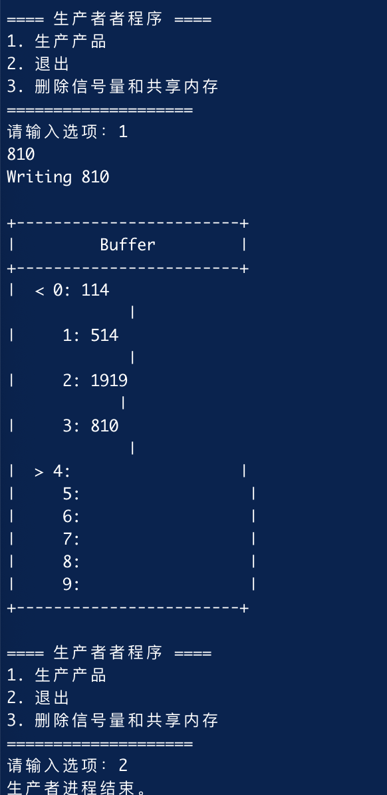
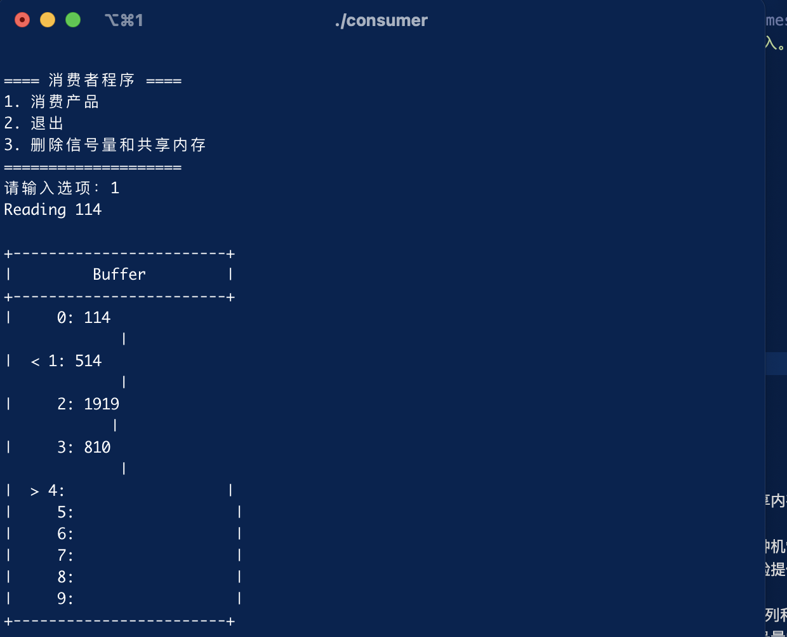
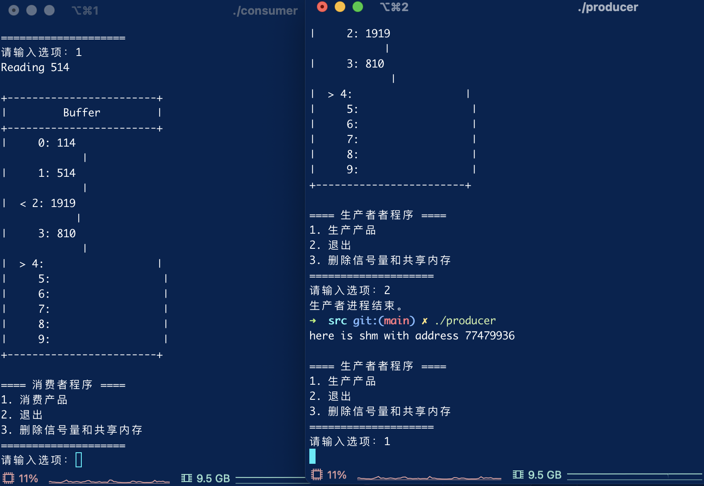
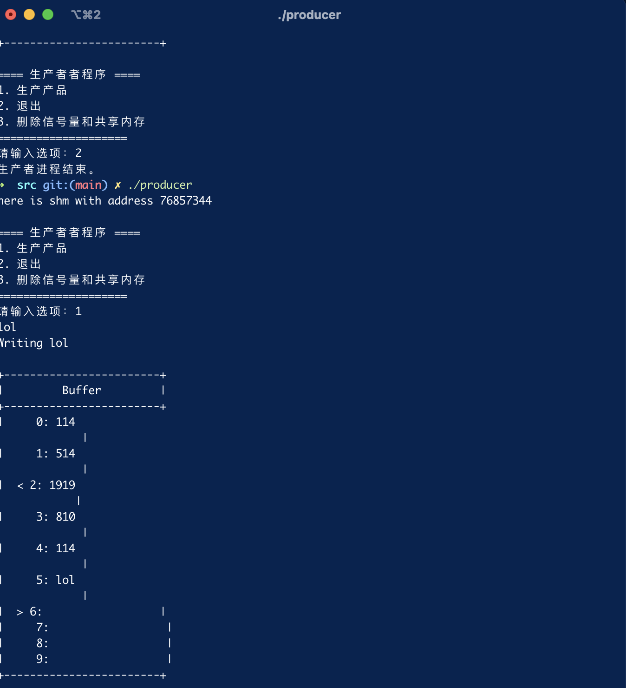
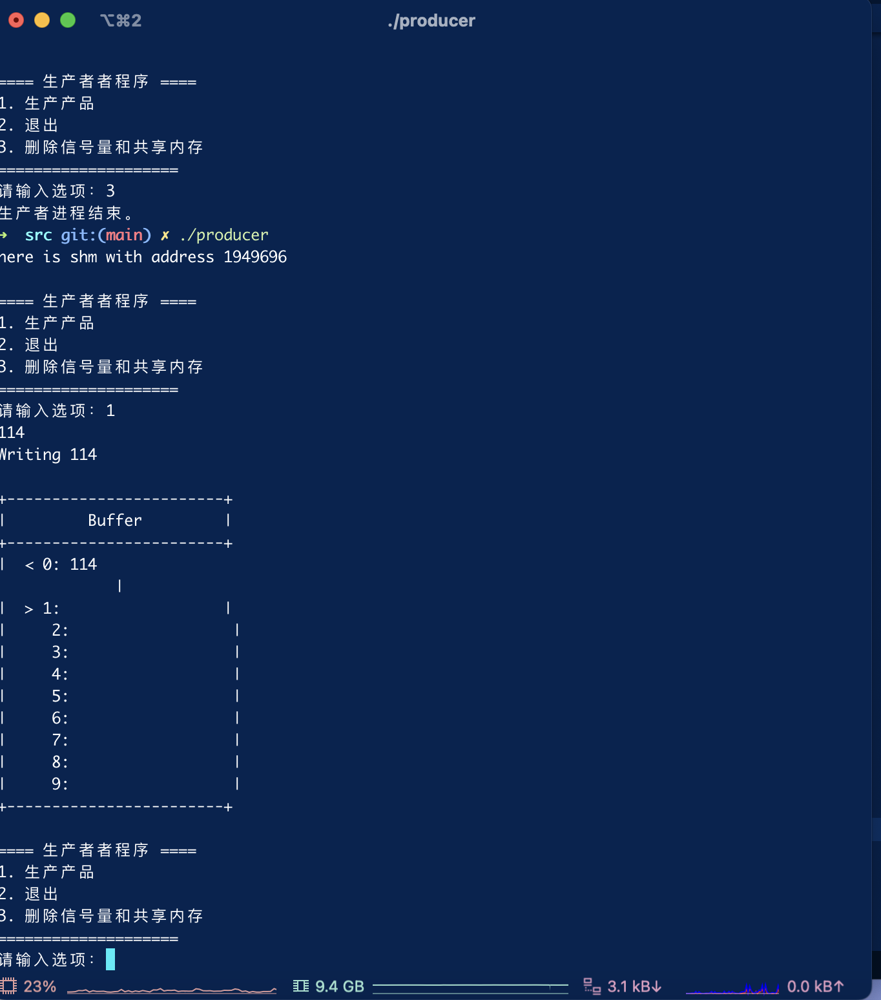

# 实验内容

1. 写两个程序，一个模拟生产者过程，一个模拟消费者过程；

2. 创建一个共享内存来模拟生产者-消费者问题中缓冲队列，该缓冲队列有N（例如N=10）个缓冲区，每个缓冲区的大小为1024B，每个生产者和消费者对缓冲区必须互斥访问；缓冲队列除了N个缓冲区外，还有一个指向第一个空缓冲区的指针in，一个指向第一个满缓冲区的指针out；

3. 由第一个生产者创建信号量集和共享内存，其他生产者和消费者可以使用该信号量集和共享内存；

4. 生产者程序：生产者生产产品（即是从键盘输入长度小于1024B的字符）放入空的缓冲区；

5. 消费者程序：消费者消费产品（即从满的缓冲区中取出内容在屏幕上打印出来），然后满的缓冲区变为空的缓冲区；

6. 多次运行生产者程序和消费者进程，同时产生多个生产者进程和多个消费者进程，这些进程共享这些信号量和共享内存，实现生产者和消费者问题；

7. 在生产者程序中，可以选择：

    1. 生产产品；

    2. 退出。退出进程，但信号量和共享内存仍然存在，其他生产者进程和消费者进程还可以继续使用；

    3. 删除信号量和共享内存。显性删除信号量和共享内存，后续其他生产者进程和消费者进程都不能使用这些信号量和共享内存。

8. 在消费者程序中，可以选择：

    (1) 消费产品；

    (2) 退出。退出进程，但信号量和共享内存仍然存在，其他生产者进程和消费者进程还可以继续使用；

    (3) 删除信号量和共享内存。显性删除信号量和共享内存，后续其他生产者进程和消费者进程都不能使用这些信号量和共享内存。

# 实验过程

本实验旨在学习并实现生产者消费者协议，使用共享内存和信号量机制来实现线程间的同步与通信。以下是实验的具体步骤：

## 在网上学习共享内存和信号量机制：

首先，深入研究共享内存和信号量机制的概念、原理和用法。了解共享内存的特点和优势，以及信号量的作用和使用方式。通过学习相关资料和教程，掌握这两种机制在多线程编程中的应用。

## 编写设置共享内存、struct简易双端队列和初始化信号量的封装函数：

基于所学知识，创建一个名为shared_memory.c的文件，并实现以下功能：

* 设置共享内存：使用系统调用或库函数创建共享内存区域，用于在生产者和消费者之间传递数据。
* 定义struct简易双端队列：设计一个结构体，包含队列的必要信息，例如缓冲区大小、头尾指针等。
* 初始化信号量：使用信号量机制，创建并初始化必要的信号量，如互斥信号量和计数信号量，确保线程间的互斥和同步。

## 编写消费者和生产者的核心逻辑：
在同一个文件中实现消费者和生产者的核心逻辑。主要步骤如下：

* 生产者逻辑：通过获取空闲缓冲区位置，将数据写入共享内存的队列中，并更新相关指针位置。若缓冲区已满，则等待消费者消费数据。
* 消费者逻辑：通过获取有数据的缓冲区位置，读取数据并进行相应处理，然后更新指针位置。若缓冲区为空，则等待生产者生产数据。
* 考虑线程同步：使用信号量机制，通过P操作和V操作来实现生产者和消费者之间的同步和互斥，确保数据的正确传递和处理。
* 编写可视化展示缓冲区内容和指针位置的函数：为了方便观察和调试，编写一个函数，用于可视化展示缓冲区的内容和指针位置。该函数可以根据实际情况，将缓冲区的数据以某种形式输出到屏幕# ，以便实时监测队列状态和指针位置的变化。

## 实验代码
本项目结构如下:

```
.
├── assert
│   ├── image.png
│   ├── image_1.png
│   ├── image_2.png
│   ├── image_3.png
│   └── image_4.png
├── doc
│   ├── lab_requirement.md
│   ├── 实验要求_生产者消费者.docx
│   └── 信号量有关函数.docx
├── lab_report.md
├── producer.dSYM
│   └── Contents
│       ├── Info.plist
│       └── Resources
│           └── DWARF
│               └── producer
└── src
    ├── Makefile
    ├── consumer
    ├── consumer.c
    ├── consumer.o
    ├── producer
    ├── producer.c
    ├── producer.o
    ├── shared_memory.c
    ├── shared_memory.h
    └── shared_memory.o
```

* `shared_memory.h `: 函数声明和常量宏
* `shared_memory.c`:封装共享内存，指针移动的机制实现
* `producer.c`:生产者
* `consumer.c`:消费者
* `Makefile`:构建规则

其核心代码如下：

```c

#include <stdio.h>
#include "shared_memory.h"

sem_t* sem_prod;
sem_t* sem_cons;
sem_t* sem_mutex;


int main() {
    // 获取共享内存标识符和信号量标识符
    struct sharedMemory* shm=(struct sharedMemory*)attach_memory_block(SECRET_KEY,sizeof(&shm));
    printf("here is shm with address %d\n",shm);
    create_sems();
    bool running=true;
    while (running) {
        // 打印菜单选项
        printf("\n==== 消费者程序 ====\n");
        printf("1. 消费产品\n");
        printf("2. 退出\n");
        printf("3. 删除信号量和共享内存\n");
        printf("====================\n");
        printf("请输入选项：");
        int choice = 0;
        scanf("%d", &choice);

        switch (choice) {
            case 1:
                sem_wait(sem_cons);  // wait for sig from consumer
                sem_wait(sem_mutex);
                if(is_valid(shm)){
                    printf("Reading %s\n", shm->buffer[shm->out]);
                    update_out_ptr(shm);
                }
                else{
                    printf("there is no element in buffer\n");
                }
                printSharedMemory(shm);
                sem_post(sem_prod);  // signal something is produced
                sem_post(sem_mutex);
                break;
            case 2:
                // 退出进程，但保留信号量和共享内存
                running = false;
                sem_close(sem_prod);
                sem_close(sem_cons);
                sem_close(sem_mutex);
                sem_close(sem_cons);
                detach_memory_block(&shm);
                break;
            case 3:
                sem_close(sem_prod);
                sem_close(sem_cons);
                sem_close(sem_mutex);
                destroy_memory_block(SECRET_KEY);
                running = false;
                break;
            default:
                printf("无效的选项，请重新选择\n");
        }
    }
    printf("消费者进程结束。\n");
    // 返回0

    return 0;
}
```

```c

#include <stdio.h>
#include <sys/semaphore.h>
#include <sys/ipc.h>
#include <string.h>
#include "shared_memory.h"

sem_t* sem_prod;
sem_t* sem_cons;
sem_t* sem_mutex;


// 定义主函数
int main() {
    //创建缓冲区和共享内存
    //struct sharedMemory* shm=malloc(sizeof(&shm));
    //init_buffer(shm);
    struct sharedMemory* shm=(struct sharedMemory*)attach_memory_block(SECRET_KEY,sizeof(&shm));
    
    printf("here is shm with address %d\n",shm);
    //初始化共享内存
    sem_unlink(SEM_MUTEX_FNAME);
    sem_unlink(SEM_CONSUMER_FNAME);
    sem_unlink(SEM_PRODUCER_FNAME);
    create_sems();
    // 循环等待用户的输入
    // Loop until user chooses to exit
    bool running=true;
    while (running) {
        // Display menu
        printf("\n==== 生产者者程序 ====\n");
        printf("1. 生产产品\n");
        printf("2. 退出\n");
        printf("3. 删除信号量和共享内存\n");
        printf("====================\n");
        printf("请输入选项：");
        // Read user's choice
        int choice;
        scanf("%d", &choice);
        // Perform the corresponding action based on the user's choice
        switch (choice) {
            case 1:
                // Call the production function to add a product to the buffer
                sem_wait(sem_prod);  // wait for sig from consumer
                sem_wait(sem_mutex);
                if(is_valid(shm)){
                    fflush(stdin);
                    fgets(shm->buffer[shm->in],sizeof(shm->buffer[shm->in]),stdin);
                    printf("Writing %s\n", shm->buffer[shm->in]);
                    update_in_ptr(shm);
                }
                else{
                    printf("buffer is full\n");
                }
                printSharedMemory(shm);
                sem_post(sem_cons);  // signal something is produced
                sem_post(sem_mutex);
                break;
            case 2:
                // Set running flag to false and exit the loop
                sem_close(sem_prod);
                sem_close(sem_cons);
                sem_close(sem_mutex);
                running = false;
                detach_memory_block(&shm);
                break;
            case 3:
                // Call the function to delete the semaphores and shared memory
                // Set running flag to false and exit the loop
                sem_close(sem_prod);
                sem_close(sem_cons);
                sem_close(sem_mutex);
                destroy_memory_block(SECRET_KEY);
                running = false;
                break;
            default:
                // Display invalid input message
                printf("无效的输入，请重新输入。\n");
                break;
        }
    }
    printf("生产者进程结束。\n");
    // 返回0
    return 0;
}

```
# 实验结果

## 生产产品

## 读取内容

## 多进程访问和控制冲突

## 关闭共享内存和再次打开

## 删除共享内存



# 实验心得

在完成生产者消费者协议的实验过程中，我通过学习共享内存和信号量机制，编写代码并实现了进程间的同步与通信。以下是我对这次实验的心得总结：

首先，在网上学习共享内存和信号量机制对我理解这两种机制的原理和应用起到了关键作用。通过深入研究相关资料和教程，我对共享内存的特点和优势有了更清晰的认识，也了解了信号量在多进程编程中的重要作用。这为我后续的实验提供了坚实的基础。

接着，我编写了设置共享内存、定义struct简易双端队列和初始化信号量的封装函数。这些函数的编写过程中，我学会了如何使用系统调用或库函数创建共享内存区域，以及如何设计并初始化信号量。这不仅加深了我对共享内存和信号量的理解，还提高了我在多进程编程中的实践能力。

然后，我着重编写了消费者和生产者的核心逻辑。通过获取空闲缓冲区位置、将数据写入队列、更新指针位置等步骤，我成功实现了生产者和消费者之间的数据传递。在这个过程中，我特别注意了进程的同步与互斥，使用信号量机制来确保数据的正确传递和处理。这使我更加熟悉了信号量的P操作和V操作，并加深了我对进程同步的理解。

最后，为了方便观察和调试，我编写了可视化展示缓冲区内容和指针位置的函数。这个函数对于实时监测队列状态和指针位置的变化非常有帮助，也提高了我调试程序的效率。

通过这次实验，我不仅掌握了生产者消费者协议的工作原理，还学会了使用共享内存和信号量机制来实现线程间的通信和同步。我深刻体会到了多进程编程的复杂性和重要性，以及线程同步在保证程序正确性和稳定性方面的重要作用。

总的来说，这次实验让我受益匪浅。我将继续深入学习和探索多线程编程的知识，不断提升自己在这个领域的技能和能力。同时，我也意识到了在实际开发中合理使用共享内存和信号量机制的重要性。